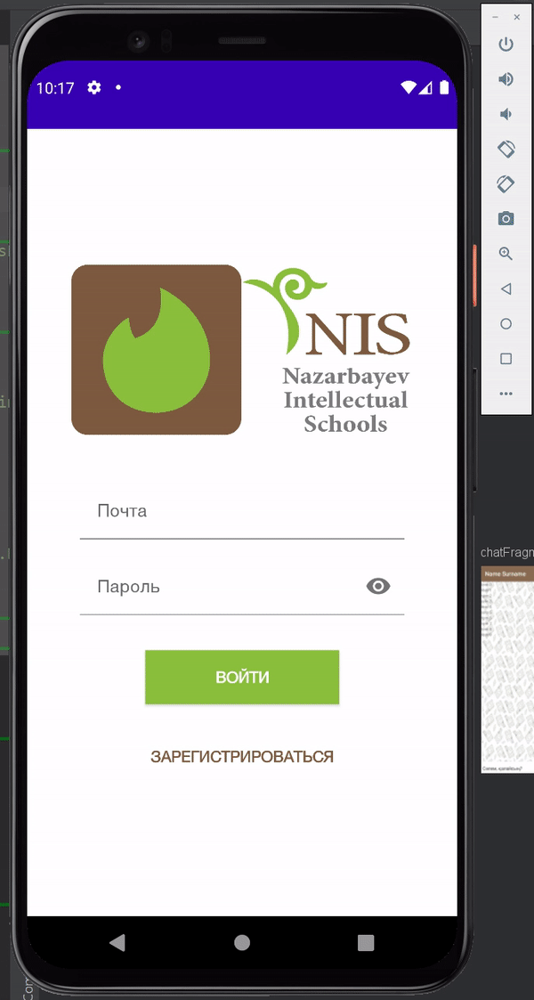

# NIS-Alumni-Mentorship

- Application that allows NIS alumni and students to mentor each other.
- Implemented login and registration. A member gets an option to be a Mentor or a Mentee, and can customize
the app profile with their username, bio, skills, location, occupation, etc. anytime.
- Implemented chat with Firebase Realtime Database.
- Used CardStackView library to make Tinder-like swipe cards.
- Used: Kotlin, MVVM, Dagger-Hilt, Retrofit, Jetpack Navigation, Firebase Realtime Database.

